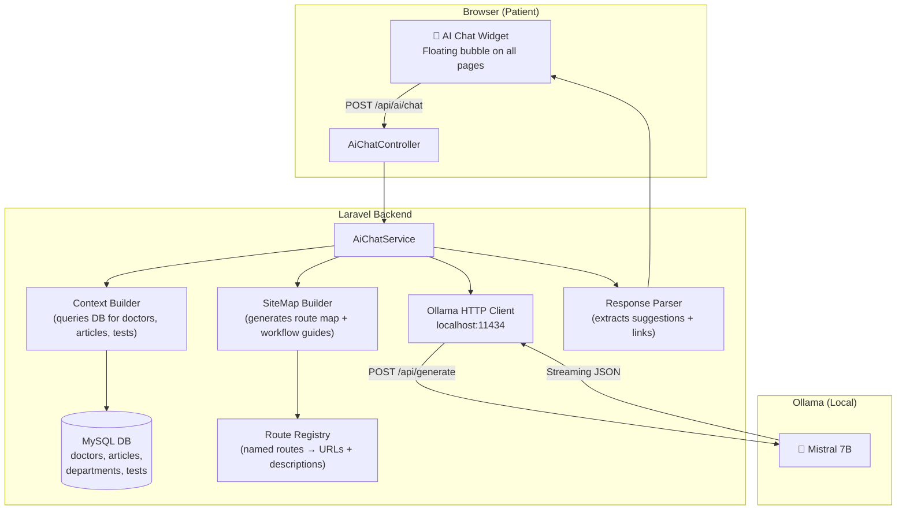
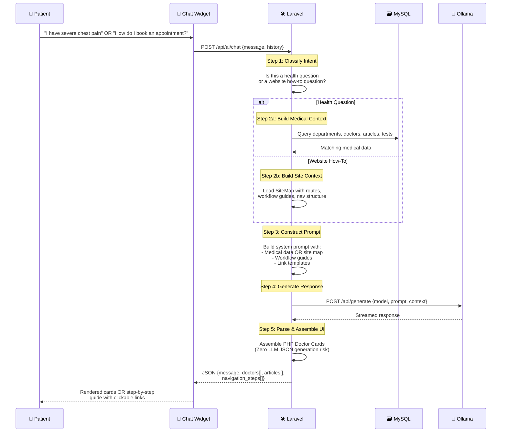
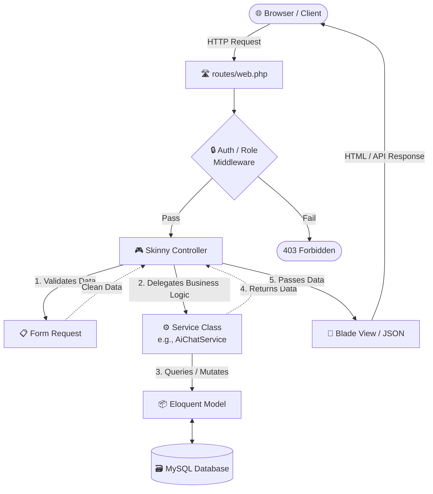
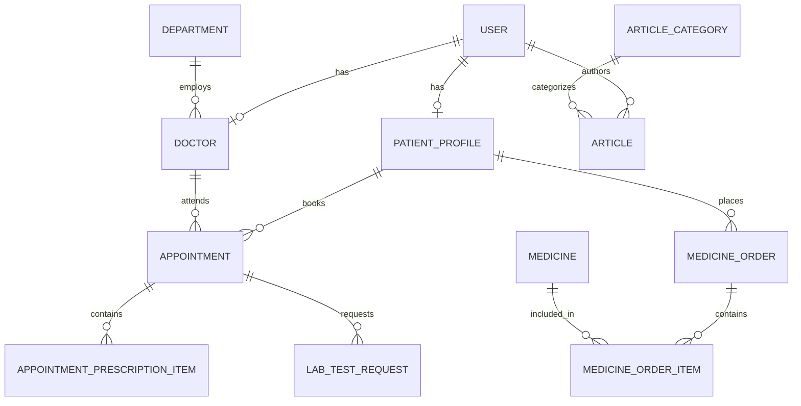
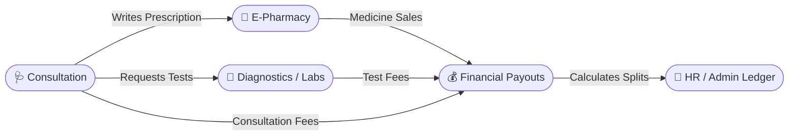

<div align="center">
  
  <h1>HelloMed</h1>
  <p><b>A Comprehensive, State-of-the-Art Hospital Management & Digital Health Platform</b></p>

  [](https://laravel.com)
  [](https://php.net)
  [](https://mysql.com)
  [](https://ollama.com)
  [](LICENSE)
</div>

<br/>

## 📑 Table of Contents

- [About HelloMed](#-about-hellomed)
  - [Vision \& Mission](#vision--mission)
  - [The Aesthetic](#the-aesthetic)
- [State-of-the-Art Features](#-state-of-the-art-features)
  - [AI Health Assistant](#-ai-health-assistant)
  - [Automated Financial Payout Engine](#-automated-financial-payout-engine)
  - [Advanced E-Pharmacy \& Geolocation](#-advanced-e-pharmacy--geolocation)
  - [Real-time Emergency Dispatch](#-real-time-emergency-dispatch)
  - [Comprehensive Notification System](#-comprehensive-notification-system)
  - [Automated Prescriptions \& Lab Results](#-automated-prescriptions--lab-results)
- [AI Integration Deep Dive](#-ai-integration-deep-dive)
  - [Query Modes](#query-modes)
  - [System Architecture](#system-architecture)
  - [The Three-Stage RAG Pipeline](#the-three-stage-rag-pipeline)
  - [Model Recommendations](#model-recommendations)
- [Role-Based Workflows](#-role-based-workflows)
  - [Role-Based Access Control (RBAC) Matrix](#-role-based-access-control-rbac-matrix)
- [Architecture \& Design Patterns](#-architecture--design-patterns)
- [Technology Stack](#-technology-stack)
- [Database Schema \& Relations](#️-database-schema--relations)
- [Module Integrations](#-module-integrations)
- [Security \& Industry Standards](#️-security--industry-standards)
- [Getting Started (Local Setup)](#-getting-started-local-setup)
  - [Prerequisites](#prerequisites)
  - [Installation Steps](#installation-steps)
  - [Ollama AI Setup](#ollama-ai-setup)
- [Seeded Data Overview](#-seeded-data-overview)
- [API Documentation \& Links](#-api-documentation--links)
- [Developer Info \& License](#-developer-info--license)

---

## 🏥 About HelloMed

### Vision & Mission
HelloMed is a modern, full-stack hospital management system and digital health platform designed to bridge the gap between patients and healthcare providers. At the heart of this experience is a **Local, Privacy-First AI Health Assistant** that intelligently guides patients through symptom checking, provides step-by-step website navigation, and surfaces relevant doctors and articles. Beyond AI-driven guidance, HelloMed provides a seamless experience for patients to book appointments (both online and offline), order medicines, request emergency ambulances, and read health articles. Simultaneously, it gives hospital staff, doctors, and administrators powerful, centralized tools to manage daily operations, financials, and inventory.

### The Aesthetic
Developed with a clean, premium teal-and-white aesthetic, HelloMed focuses heavily on user experience, performance, accessibility, and cutting-edge local AI integration. Custom CSS variables and strict layout consistency ensure a responsive, native-app feel across all devices.

---

## ✨ State-of-the-Art Features

HelloMed goes significantly beyond standard CRUD operations, implementing advanced, industry-grade workflows:

### 🤖 AI Health Assistant
A floating chat widget powered by a locally hosted Mistral LLM via Ollama. No data leaves the server, ensuring strict patient data privacy. Patients often don't know which specific medical department to visit for their symptoms - this AI elegantly solves that issue by analyzing their natural language symptoms and automatically routing them to the correct specialist department, all while maintaining strict medical safety and explicitly avoiding self-diagnosis. Features three distinct modes: symptom checking, general health info, and complete site navigation walkthroughs.

### 💰 Automated Financial Payout Engine
A centralized financial sync command (`app:sync-financials`) dynamically calculates Doctor commission cuts (e.g., 95% online, 85% offline) and Hospital profit cuts instantly upon appointment completion. It features smart reopening logic for employee payouts if salaries are adjusted mid-cycle.

### 💊 Advanced E-Pharmacy & Geolocation
An integrated medicine catalog with a cart system, digital prescription verification (allowing restricted medicines to be sold only with uploaded proof), and patient geolocation sharing for precise Google Maps delivery routing. Patients can seamlessly add all necessary prescribed medicines to their cart directly from their appointment page or prescription pdf with a single click.

### 🚑 Real-time Emergency Dispatch
A public-facing emergency ambulance request form with live staff dispatch tracking, status updates, GPS location sharing for precise pinpointing, and zero login barriers for critical situations.

### 🔔 Comprehensive Notification System
Role-based notifications for Patients, Doctors, Pharmacists, Staff, and Admins. Features async polling for unread badges and clickable notification cards with severity indicators (Red/Yellow/Green) for appointments, chats, lab results, prescriptions, and stock warnings.

### 📄 Automated Prescriptions & Lab Results
Doctors can digitally write structured prescriptions and request diagnostic tests directly from the consultation panel. The system automatically generates a formatted PDF prescription for the patient, while staff can securely process lab payments and upload diagnostic PDF results directly to the patient's portal for seamless digital delivery.

---

## 🧠 AI Integration Deep Dive

The AI Assistant in HelloMed is designed with privacy, accuracy, and absolute determinism at its core. Instead of standard vector-based RAG, it uses a highly controlled architecture to prevent LLM hallucinations and JSON corruption.

### Query Modes
1. **Health Mode**: Patient describes symptoms → AI classifies department → PHP fetches live doctors/articles → AI responds empathetically mentioning them by name.
2. **Info Mode**: "What is X?" queries → direct exact-match search against diagnostic tests and health articles.
3. **How-To / Navigation Mode**: Pre-built step-by-step workflow guides (book appointment, order medicine, view prescription) with real, PHP-generated clickable links.

### System Architecture



### The Three-Stage RAG Pipeline



### Model Recommendations
For optimal performance on local hardware, **Mistral 7B** is recommended (~4.1GB VRAM, ~3s latency), while **Phi3:Mini** is supported as an ultra-lightweight fallback for lower-end machines.

---


## 🔄 Role-Based Workflows

The platform supports comprehensive, end-to-end workflows tailored for each specific user role.

### 👤 1. Patient Workflow
- **Onboarding:** Register a new account or browse the platform as a guest. (Ambulance requests and AI Chat are available without login).
- **Profile Management:** Update personal medical history, allergies, height, weight, and contact information. Incomplete profiles trigger a site-wide reminder banner.
- **Booking Consultations:** Filter doctors by department and specialty. Select between online or offline modes. Choose an available date/time slot, proceed to checkout, and verify payment via bKash/Nagad.
- **Online Consultation & Chat:** Access the secure meeting link at the scheduled time. Use the integrated appointment chat to message the doctor or upload past medical documents (PDF/JPG) before the session.
- **Post-Consultation:** Download the digital prescription PDF generated by the doctor. Click the auto-generated "Buy Medicines" link to instantly add prescribed items to the pharmacy cart.
- **E-Pharmacy Shopping:** Browse the medicine catalog, add items to the cart, provide a delivery address (with Google Maps geolocation), and complete the purchase. Track order status in real-time.
- **Diagnostics & Results:** View requested lab tests. Once staff uploads the results, download the PDF reports securely.
- **Engagement:** Rate doctors and leave feedback after completed appointments. Ask health questions in the public Q&A forum.

### 👨‍⚕️ 2. Doctor Workflow
- **Profile & Schedule Management:** Log into the Doctor Dashboard. Update availability schedules (working days, online vs. offline hours, slot durations) and consultation fees.
- **Appointment Management:** View upcoming appointments. Confirm or cancel bookings. Start online consultations by providing a meeting link.
- **Patient Interaction:** Chat directly with patients within the appointment panel. Review uploaded patient documents prior to the meeting.
- **Clinical Operations:** 
  - **Prescriptions:** Write structured digital prescriptions (Diagnosis, Advice, Follow-up date) and add specific medicines with precise dosages.
  - **Lab Tests:** Request specific diagnostic tests for the patient directly from the consultation panel.
- **Financial Tracking:** View automated commission cuts for every completed appointment in real-time.
- **Outreach & Authority:** Write and publish health articles to the public blog to establish authority and attract patients. Answer patient questions in the public Q&A forum.

### 👔 3. Admin Workflow
- **System Oversight:** Monitor the high-level `/analytics` dashboard containing dynamic Chart.js graphs for Hospital Net Profit, Monthly Income vs. Expense, and Payout distributions.
- **Curation & CMS:** Manage Departments, Doctors, and Articles. Toggle `is_featured` flags to dynamically curate and reorganize the public homepage.
- **User Management:** Register and manage new hospital staff members, doctors, and pharmacists. Handle role assignments.
- **Financial & Payout Management:** Monitor the `employee_payouts` ledger. Settle pending payouts for doctors and staff. Review detailed audit logs for sensitive financial or status changes.
- **Inventory Oversight:** Add new medicines, update pricing, and manage global inventory (including uploading medicine imagery).

### 🚑 4. Staff Workflow
- **Walk-in Management:** Register new patients arriving at the hospital. Book offline physical appointments on their behalf bypassing the standard patient checkout flow.
- **Emergency Dispatch:** Monitor a live feed of incoming emergency ambulance requests. Dispatch vehicles and update real-time statuses for the patient.
- **Diagnostic/Lab Processing:** Monitor lab tests requested by doctors. Process physical payments from patients at the counter, conduct the tests, and securely upload the resulting PDF reports to the patient's file.
- **Content Moderation:** Review and moderate public article comments and Q&A forum entries to maintain community standards.

### 💊 5. Pharmacist Workflow
- **Inventory Management:** Actively monitor medicine stock levels. Update stock quantities, adjust prices, and categorize medicines by group and strength.
- **Order Fulfillment:** Review incoming patient E-Pharmacy orders.
- **Prescription Verification:** For restricted medicines, open the automatically attached digital prescription PDF to verify the doctor's authorization before approving the sale.
- **Status Management:** Explicitly override default order and payment statuses to manage the physical dispatch and delivery lifecycle. Update orders to "Processing", "Dispatched", or "Delivered".

### 🌍 6. Guest Workflow
- **Exploration:** Browse all departments, doctor profiles, and public health articles.
- **AI Assistance:** Chat with the floating AI Assistant to check symptoms, find doctors, or get site navigation help.
- **Emergency:** Use the 1-click Ambulance Request form without needing to create an account.
- **E-Pharmacy Browsing:** Search the medicine catalog and view prices (checkout requires login).

### 🔐 Role-Based Access Control (RBAC) Matrix

HelloMed employs a strict multi-role system, securing routes, sidebar navigation, and data visibility based on the authenticated user session.

| Feature / Module | Patient | Doctor | Pharmacist | Staff | Admin | Guest |
| :--- | :---: | :---: | :---: | :---: | :---: | :---: |
| Browse Doctors & Articles | ✅ | ✅ | ✅ | ✅ | ✅ | ✅ |
| Use AI Assistant | ✅ | ✅ | ✅ | ✅ | ✅ | ✅ |
| Request Ambulance | ✅ | ✅ | ✅ | ✅ | ✅ | ✅ |
| Book Appointments | ✅ | ❌ | ❌ | ✅ (Walk-ins) | ❌ | ❌ |
| View Own Prescriptions | ✅ | ❌ | ❌ | ❌ | ❌ | ❌ |
| Order Medicines | ✅ | ❌ | ❌ | ❌ | ❌ | ❌ |
| Manage Schedule & Slots | ❌ | ✅ | ❌ | ❌ | ❌ | ❌ |
| Write Prescriptions | ❌ | ✅ | ❌ | ❌ | ❌ | ❌ |
| Process Lab Tests | ❌ | ❌ | ❌ | ✅ | ❌ | ❌ |
| Fulfill Medicine Orders | ❌ | ❌ | ✅ | ❌ | ❌ | ❌ |
| View Hospital Analytics | ❌ | ❌ | ❌ | ❌ | ✅ | ❌ |
| Manage System Users | ❌ | ❌ | ❌ | ❌ | ✅ | ❌ |

---

## 🏗 Architecture & Design Patterns

The platform follows a monolithic **Model-View-Controller (MVC)** architecture, greatly enhanced by modern Laravel ecosystem patterns. 

Below is a diagram illustrating the typical request lifecycle and how the layers interact:



1. **Service Repository Pattern**: Core business logic (e.g., `AiChatService`, `AppointmentSlotService`, `FinancialSyncService`) is abstracted away from controllers, ensuring controllers remain "skinny" and focused solely on HTTP request/response lifecycles.
2. **Form Requests**: Deep validation logic, authorization checks, and data sanitization are offloaded to dedicated Form Request classes.
3. **Idempotent Migrations**: Schema updates utilize defensive checks (`Schema::hasColumn`) to ensure safe, repeatable migrations in production environments.
4. **State Management**: Handled natively via Blade components, keeping JavaScript dependencies to an absolute minimum. Auto-submitting forms manage SSR state filtering.

---

## 💻 Technology Stack

### Backend
- **Framework:** Laravel 11.x
- **Language:** PHP 8.2+
- **Database:** MySQL (Relational, ACID-compliant, standard for health data)
- **Security:** Laravel Sanctum, built-in CSRF & XSS protection, Password Hashing.

### Frontend
- **Templating:** Laravel Blade (Server-side rendering for optimal SEO, accessibility, and TTFB performance)
- **Styling:** Custom Vanilla CSS with CSS Variables (No external frameworks; bespoke premium design system)
- **Build Tool:** Vite (for rapid HMR and asset bundling)
- **Interactivity:** Vanilla JavaScript (Lightweight DOM manipulation, dynamic filter submission, SSE streaming)

### AI / LLM
- **Runtime:** [Ollama](https://ollama.com) - Local LLM inference, completely bypassing cloud APIs
- **Model:** `mistral` (7B) - runs entirely on the host machine
- **Architecture:** Three-stage deterministic pipeline
- **Privacy:** All patient queries stay on-device; HIPAA-compliant concept by default.

---

## 🗄️ Database Schema & Relations

The database is highly relational, utilizing Eloquent ORM. Below is a macro-level Entity-Relationship (ER) diagram representing core connections.



---

## 🔌 Module Integrations

HelloMed features tight workflow integration across its core modules. Data and financials naturally flow from the consultation room into the rest of the hospital's ecosystem:



- **Consultation ➡️ Pharmacy**: Doctors write digital prescriptions inside the appointment panel. Patients download the resulting PDF and directly click to order those specific medicines. The Pharmacist verifies the attached prescription PDF during order fulfillment.

  ```mermaid
  sequenceDiagram
      participant D as 👨‍⚕️ Doctor
      participant S as ⚙️ System
      participant P as 🧑 Patient
      participant Rx as 💊 Pharmacist

      D->>S: Writes Digital Prescription
      S-->>P: Generates PDF & 'Buy Medicines' link
      P->>S: Clicks Buy -> Adds to Cart -> Checkout
      S-->>Rx: Notifies Pharmacist of New Order
      Rx->>S: Opens Order & Views attached PDF
      Rx->>Rx: Verifies Doctor's signature & validity
      Rx->>S: Approves & Dispatches Order
      S-->>P: Status updated to 'Dispatched'
  ```

- **Consultation ➡️ Labs**: Doctors request specific diagnostic tests. Hospital Staff process the payment and upload the PDF results. Both Patient and Doctor receive notifications and can download the results securely.
- **Financials ➡️ HR/Admin**: Paid appointments and medicine sales trigger the `sync-financials` job, calculating exact hospital profit cuts and logging amounts into the `employee_payouts` ledger automatically for payroll processing.

  ```mermaid
  sequenceDiagram
      participant P as 🧑 Patient
      participant DB as 🗃️ Database
      participant Cron as 🔄 sync-financials
      participant A as 👔 Admin

      P->>DB: Pays ৳1000 for Online Appointment
      DB->>DB: Status -> 'completed'
      Cron->>DB: Scans for unsynced completed appts
      Note over Cron: Applies 95% Doctor Cut
      Cron->>DB: Logs ৳950 to Employee Payouts
      Cron->>DB: Logs ৳50 to Hospital Net Profit
      Cron->>DB: Marks Appt as 'financials_synced'
      A->>DB: Views Analytics Dashboard & Payouts Ledger
  ```

---

## 🛡️ Security & Industry Standards

- **Authentication & Authorization**: Built-in Laravel Auth coupled with strict Route Middleware checks (`role:admin,staff`, etc.).
- **Data Integrity**: Deep relational database constraints, cascading deletes where appropriate, and strict PHP-backed status enums.
- **Audit Logging**: Sensitive operations (financial adjustments, status overrides, user role changes) are securely logged in the `audit_logs` table for admin review and compliance.
- **Payment Lifecycle Security**: Inventory commit/release safeguards ensure medicine stock isn't permanently depleted until a payment is fully verified.
- **Protected File Uploads**: Prescriptions and lab results are stored securely in protected storage directories and served strictly via authenticated routes.

---

## 🚀 Getting Started (Local Setup)

### Prerequisites
- PHP 8.2 or higher
- Composer
- Node.js & NPM
- MySQL Server

### Installation Steps

1. **Clone the repository**
   ```bash
   git clone https://github.com/AbirHasanArko/HelloMed.git
   cd hellomed/hellomed-laravel
   ```

2. **Install Dependencies**
   ```bash
   composer install
   npm install
   ```

3. **Environment & Keys**
   ```bash
   cp .env.example .env
   php artisan key:generate
   ```

4. **Database Setup**
   Create an empty database named `hellomed` in your MySQL instance. Ensure `.env` has `DB_CONNECTION=mysql`.
   ```bash
   # Migrate tables and seed the database with demo data
   php artisan migrate:fresh --seed
   
   # Link storage for image uploads
   php artisan storage:link
   ```

5. **Run the Application**
   Open two terminal windows:
   ```bash
   # Terminal 1: Boot backend server
   php artisan serve

   # Terminal 2: Compile frontend assets
   npm run dev
   ```

### Ollama AI Setup
The AI assistant requires [Ollama](https://ollama.com) running locally.
```bash
# Pull the model
ollama pull mistral

# Start the Ollama server (runs on localhost:11434 by default)
ollama serve          
```
*(If Ollama is not running, the platform gracefully disables the chat widget with a friendly offline message).*

---

## 👥 Seeded Data Overview

Running the `DatabaseSeeder` populates a complete, demo-ready environment instantly:

**Roles & Accounts (Password: `password123`)**
- Admin: `admin@hellomed.test`
- Staff: `staff@hellomed.test`
- Pharmacist: `pharmacist@hellomed.test`
- Doctor: `doctor@hellomed.test` (plus specific doctors like `nazmul@hellomed.test`)
- Patient: `patient@hellomed.test`

**Initial Data Sandbox Includes:**
- **8 Departments** (Cardiology, Orthopedics, Dental, Psychiatry, Neurology, Pediatrics, Dermatology, Oncology).
- **8 Specialist Doctors** with detailed bios, varying consultation fees, and online/offline availability schedules.
- **3 Article Categories** containing pre-written, published health articles.
- **10+ Verified Medicines** spanning tablets, capsules, and syrups with simulated stock, prices, and placeholder imagery.
- **Diagnostic Tests Catalog** (via `AvailableTestSeeder`).
- **Pre-populated Workflows**: Fully booked appointments, written prescriptions, lab tests, and Q&A entries to instantly demonstrate functionality without needing manual data entry.

---

## 🔗 API Documentation & Links

- **Detailed API Documentation**: Check out the [API_DOCUMENTATION.md](API_DOCUMENTATION.md) file for comprehensive details on the AI Health Assistant JSON endpoints, including exact Request/Response schemas and authentication methods.
- **Web Routes**: All user-facing and backend SSR routes are organized logically in `routes/web.php` grouped by applied middleware.
- **License**: See the [LICENSE](LICENSE) file for proprietary usage restrictions and guidelines.

---

<div align="center">
  <p><b>Developed with ❤️ for the future of digital healthcare.</b></p>
  <p><i>Developed by <a href="https://github.com/AbirHasanArko">Abir Hasan Arko</a></i></p>
</div>

---